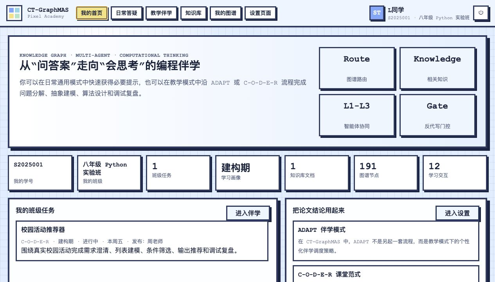
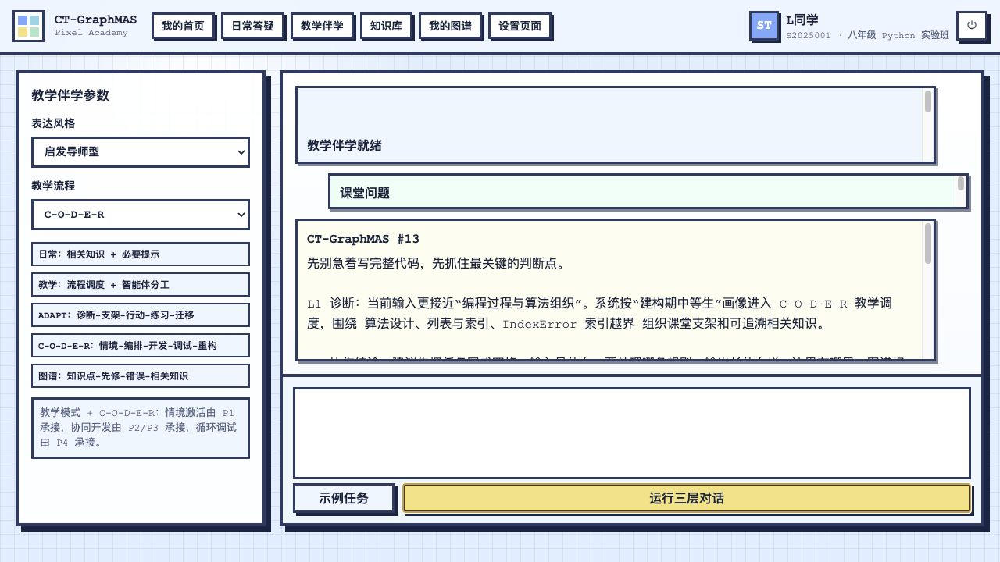
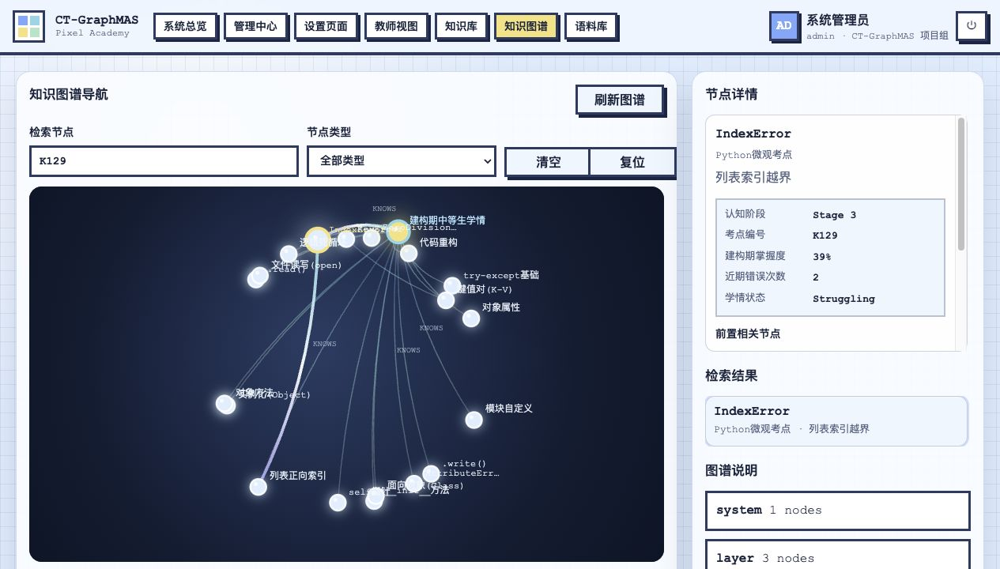
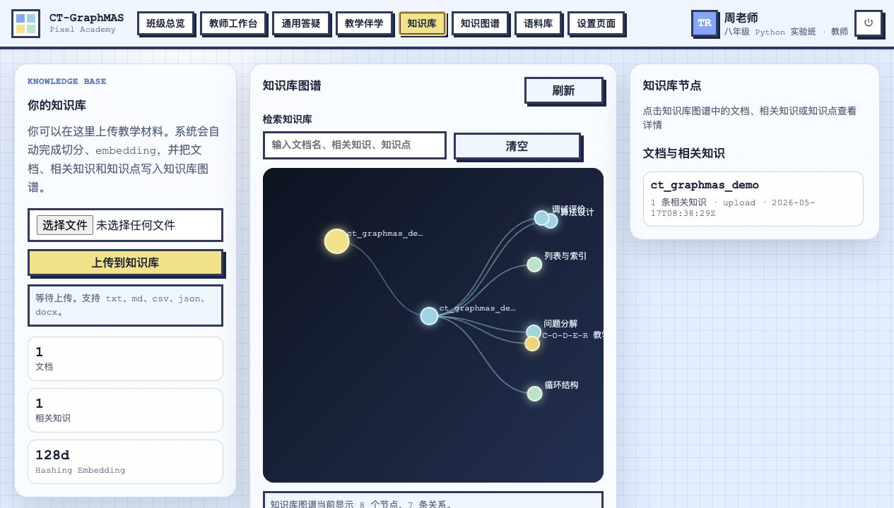
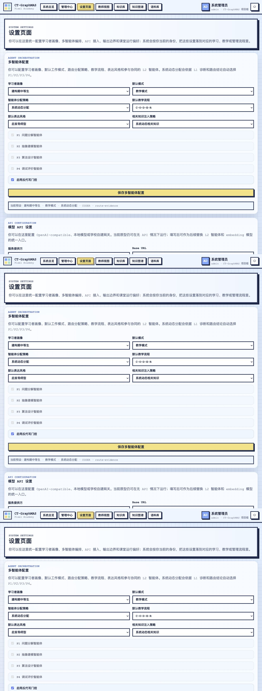

# CT-GraphMAS 主要功能与提示词工作流说明

本说明面向结题报告与系统展示使用，只保留系统主要功能、核心提示词设计和可视化工作流，不展开安装部署细节。系统截图位于 `static/assets/guides/`，均来自当前本地原型页面。

## 1. 角色化入口与班级任务

学生端以“我的首页”为入口，展示默认学号、所在班级、教师已分配任务和个人学习画像，避免把用户统计、全局任务等管理信息暴露给学生。教师端可在工作台中发布班级任务，任务包含班级、画像、流程、状态、截止说明与任务描述；只有“已分配”或“进行中”的本班任务会进入学生端。

## 2. 教学伴学与三层多智能体反馈

教学伴学页用于课堂任务或项目式编程活动。学生输入问题后，系统依次执行 L1 诊断、L2 计算思维教研和 L3 启发式呈现，并同步展示过程日志。日常通用模式固定为标准辅导，只做低干扰提示；教学模式可切换 C-O-D-E-R 或 ADAPT，用于课堂任务推进、伴学支架和迁移反思。

## 3. 知识图谱与 145 个微观考点

系统内置 145 个 Python 微观考点节点，节点属性包含考点编号、认知阶段、概念说明和建构期中等生掌握度。图谱关系包括 `KNOWS` 学情掌握关系与 `REQUIRES` 前置依赖关系。用户可以搜索、拖动、点击节点，并在详情区查看前置相关节点、掌握度、近期错误次数和学情状态。

## 4. 知识库与相关知识图谱化

知识库页支持上传教学材料，系统自动完成文本解析、相关知识切分、确定性 embedding 和图谱回写。每个文档被转化为文档节点、相关知识节点和知识点连接，后续对话只注入少量高相关知识，避免把整份材料或完整图谱一次性塞入回答上下文。

## 5. 设置页、API 窗口与提示词契约

设置页包含三类配置：学习者画像与多智能体分配、模型 API 网关、核心提示词与工作流。API Key 仅通过页面输入并在本地配置中脱敏显示，不写入源码。未启用外部 API 时，系统使用本地规则智能体演示；启用后可将 L2 智能体生成和 embedding 模型接入 OpenAI-compatible、本地模型或学校自建网关。

## 6. 核心提示词设计

| 层级 | 角色 | 输入 | 输出 | 设计要点 |
|---|---|---|---|---|
| L1 | 学情与任务整合中枢 | 学生输入、K001-K145 意图映射、2-hop 学情上下文 | `student_dilemma`、`cognitive_state`、`target_concept`、`route`、`risk_flags` | 不直接解题，只形成诊断前置卷，为后续智能体提供结构化上下文。 |
| L2-P1 | 问题分解教研员 | L1 诊断前置卷 | 问题规模诊断与拆解步骤 | 将编程困难拆为输入、处理、输出、边界和最小可运行任务。 |
| L2-P2 | 抽象建模教研员 | L1 诊断前置卷 | 数据状态诊断与建模支架 | 引导学生识别变量、状态、列表、字典等数据表示。 |
| L2-P3 | 算法设计教研员 | L1 诊断前置卷 | 执行顺序、条件流转与循环闭环支架 | 把自然语言流程转化为可执行伪代码和控制流。 |
| L2-P4 | 评估与调试教研员 | L1 诊断前置卷 | 假设、测试样例和状态追踪策略 | 通过最小复现、边界样例和变量输出定位问题。 |
| L3 | T2 启发型导师 | 学生原问题、L2 聚合策略 | 100-500 字学生可读回复 | 只使用 L2 素材，不直接给完整代码，以连续追问和下一步行动呈现。 |

## 7. 系统运行逻辑

系统先将学生输入映射到最相关的 K 节点，再围绕该节点抽取 `KNOWS` 学情边和 `REQUIRES` 前置边，形成 2-hop 学情上下文。L1 根据任务类型、画像、目标考点和风险标记选择 L2 智能体组合；L2 可按动态路由调用 P1-P4，也可在实验条件下扩展为 15 种组合比较；L3 将聚合策略压缩为学生可执行的启发式反馈。最终结果经过反代写门控，避免完整代写、评价场景越界和过度代码化输出。
